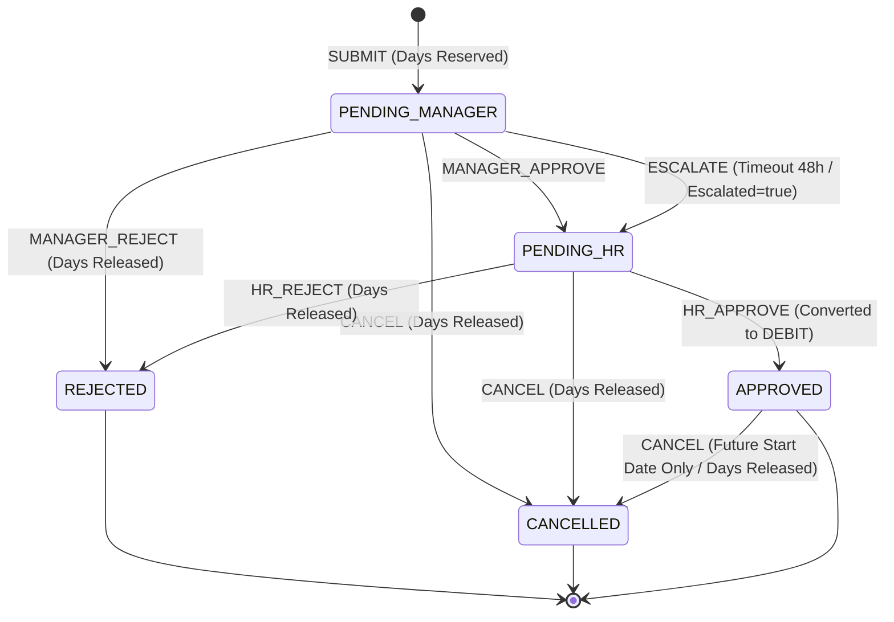

#Leave Management Application with Approval Chains & Escalations
Link-https://github.com/sudharshan200601/leave-management-system
A modular monolith Spring Boot 3.x & React application for managing employee leave requests. Featuring an explicit approval state machine, multi-level approval chains (Manager -> HR), automatic escalation on timeout, team-level leave conflict detection, and pro-rated annual leave quota calculations for mid-year joiners.

---

## 🚀 Key Features & Architectural Highlights

### 1. **Explicit State Machine Workflow**
All request state transitions are processed through `LeaveWorkflowService.transition()` which enforces an immutable state transition matrix:
- `PENDING_MANAGER` + `MANAGER_APPROVE` → `PENDING_HR`
- `PENDING_MANAGER` + `MANAGER_REJECT` → `REJECTED`
- `PENDING_MANAGER` + `CANCEL` → `CANCELLED`
- `PENDING_MANAGER` + `ESCALATE` → `PENDING_HR` (escalated = true)
- `PENDING_HR` + `HR_APPROVE` → `APPROVED`
- `PENDING_HR` + `HR_REJECT` → `REJECTED`
- `PENDING_HR` + `CANCEL` → `CANCELLED`
- `APPROVED` + `CANCEL` → `CANCELLED` (only if start date is strictly in the future)

### 2. **Pro-Rated Leave Balances (MONTHLY Method)**
- **Full Year Joiner** (Joined prior to current year or on/before Jan 15th): Full annual quota (24.0 days).
- **Mid-Year Joiner (<= 15th)**: Remaining months count includes joining month. E.g., July 10th joiner → 6 remaining months → `24 * 6 / 12 = 12.0 days`.
- **Mid-Year Joiner (> 15th)**: Remaining months start from next month. E.g., July 20th joiner → 5 remaining months → `24 * 5 / 12 = 10.0 days`.
- **December Joiner (> 15th)**: 0 remaining months → `0.0 days`.
- **Half-Day Rounding**: All leave values use `BigDecimal` rounded to the nearest `0.5` day using `RoundingMode.HALF_UP`.

### 3. **Automatic Escalation Scheduler**
- Powered by `EscalationScheduler` running on a configurable interval (`leave.escalation.check-interval-minutes=15`).
- Multi-instance safety enabled via **ShedLock** (`@SchedulerLock`).
- Automatically escalates requests exceeding manager timeout (`leave.escalation.manager-timeout-hours=48`) to HR level (`escalated = true`).
- Logs `AUTO_ESCALATED` decision with system actor and records audit log entries.

### 4. **Team-Wide Leave Conflict Detection**
- Evaluates peak teammate absence percentage against configurable threshold (`leave.conflict.max-team-absence-percent=30%`).
- Computes `peakAbsentCount / teamSize * 100`.
- Flags requests as `HIGH` (exceeds threshold) or `LOW` (>= 75% of threshold).
- **Flag, never reject**: Request is submitted with clear warning details. Conflict flags are re-evaluated whenever any teammate leave is approved or cancelled.

### 5. **Role-Based Security & Access Control**
- JWT Authentication (`POST /api/auth/login`) with stateless Spring Security.
- Method-level protection (`@PreAuthorize`).
- Enforces strict ownership: Managers cannot approve their own requests; employees can only view/cancel their own requests; managers can only act on direct reports within their team.

---

## 👥 Sample Seeded Users & Quick Login Personas

| Role | Name | Email | Password | Details / Quota |
|---|---|---|---|---|
| **HR** | Helen Rogers | `hr@company.com` | `password123` | HR Admin, Org-wide queue & Holiday CRUD |
| **MANAGER** | Sarah Jenkins | `manager1@company.com` | `password123` | Manager Team 1 (Direct reports: emp1, emp2, emp3) |
| **MANAGER** | Michael Scott | `manager2@company.com` | `password123` | Manager Team 2 (Direct reports: emp4, emp5, emp6) |
| **EMPLOYEE** | Alice Smith | `emp1@company.com` | `password123` | Team 1 (Joined Jan 15, 2025 → 24.0 days) |
| **EMPLOYEE** | Bob Johnson | `emp2@company.com` | `password123` | Team 1 (Joined Jul 10, 2026 → 12.0 days pro-rated) |
| **EMPLOYEE** | Charlie Davis | `emp3@company.com` | `password123` | Team 1 (Joined Jul 20, 2026 → 10.0 days pro-rated) |
| **EMPLOYEE** | David Wilson | `emp4@company.com` | `password123` | Team 2 (Joined Jan 1, 2026 → 24.0 days) |

---

## 📊 Approval State Transition Diagram



---

## 🛠️ Technology Stack

- **Backend**: Java 17, Spring Boot 3.2.5, Spring Data JPA, Spring Security (JWT), Validation, Actuator, ShedLock, H2 Database (PostgreSQL compatible).
- **Frontend**: React (Vite), React Router v6, Axios, Lucide React icons, Glassmorphic CSS Design System.
- **Testing**: JUnit 5, Mockito, Spring Boot Test.

---

## ⚡ How to Run the Application

### 1. Run the Spring Boot Backend
```bash
cd backend
mvn spring-boot:run
```
- Backend starts at: `http://localhost:8080`
- Swagger OpenAPI Docs: `http://localhost:8080/swagger-ui.html`
- H2 Console: `http://localhost:8080/h2-console` (JDBC URL: `jdbc:h2:mem:leavedb`, User: `sa`, Password: empty)

### 2. Run the React Frontend
```bash
cd frontend
npm install
npm run dev
```
- Frontend starts at: `http://localhost:5173`

---

## 🧪 Running Verification Tests

```bash
cd backend
mvn clean test
```
All unit, service, escalation, and full-flow integration tests execute and pass cleanly.
